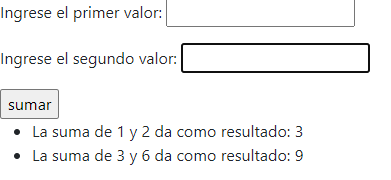

# Apuntes de clase

- El ejercicio de esta clase se trata de un pequeño formulario con dos inputs los cuales reciben un número cada uno y el resultado de su suma se muestra abajo en un listado que perdura y se va acumulando con cada nueva operación, como lo muestra el ejemplo de abajo: 

## Resultado final

### Pasos para correr el proyecto
Relizar primero `npm install`
Relizar segundo `npm start`