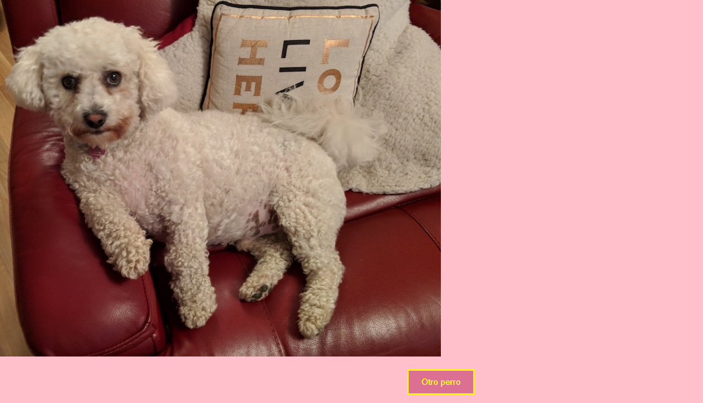

# Apuntes de clase

- El ejercicio de esta clase se trata de una pequeña App que renderiza imagenes de perritos a través de llamado a una API que contiene esa información. Usamos Fectch y los dos Hooks vistos hasta el momento: useState() y useEffect().

## Resultado final

### Pasos para correr el proyecto
- Relizar primero `npm install`
- Relizar segundo `npm start`
