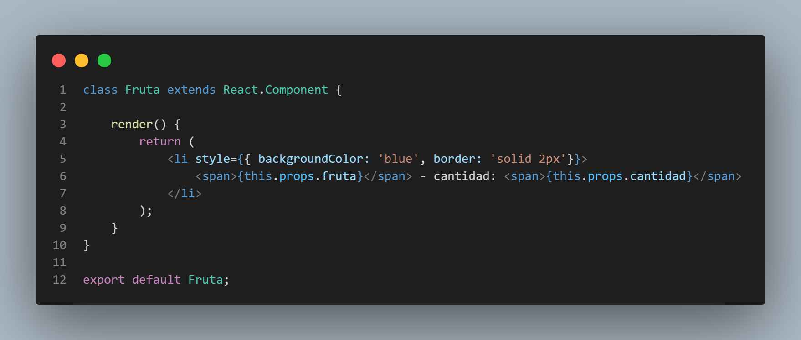
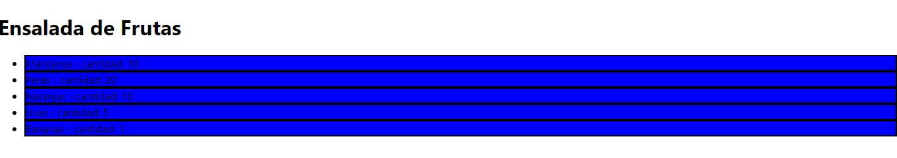

# Notas de clase

- Cada componente del tipo fruta si bien es la misma trabaja diferente. Cada una es una instancia de la clase componente.
- En los componentes de clases no es necesarios avisarle que va recibir props. Directamente cuando se hacen refrencias al objeto `props`, ya se dá por sentado que existen.

- Recordar que el uso de `props` es unidireccional. SIEMPRE pasas de padre a hijos. 
- Cada componente se renderiza indfependientemente del otro. 
- Resultado en el navegador: 

### `Aviso importante:`
Para ejecutar este repositorio localmente antes se debe intalar nuevamente la carpeta `node-modules` con la instrucción: 
- npm install

Luego ya podemos correr la aplicaciòn con: 
- npm start 

