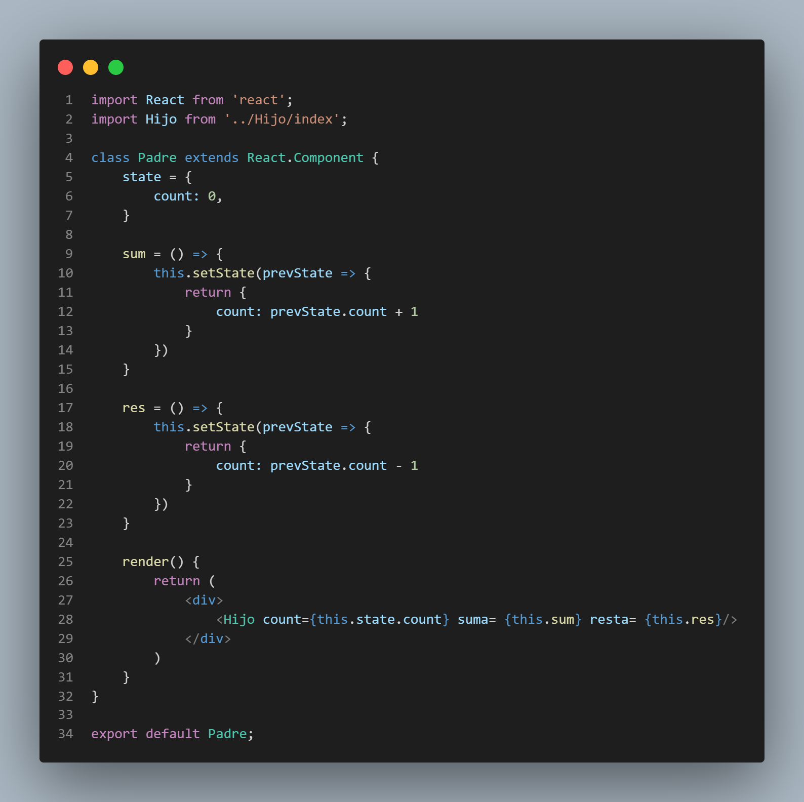
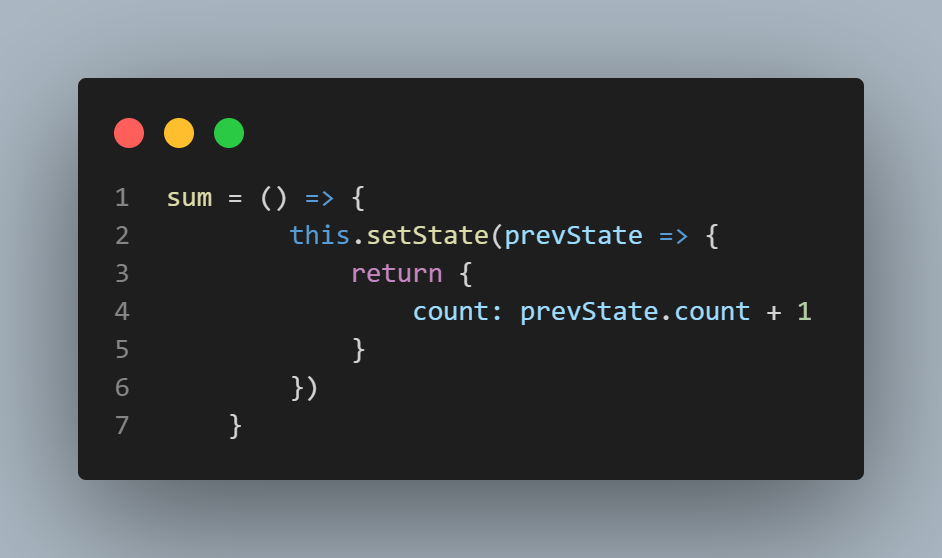
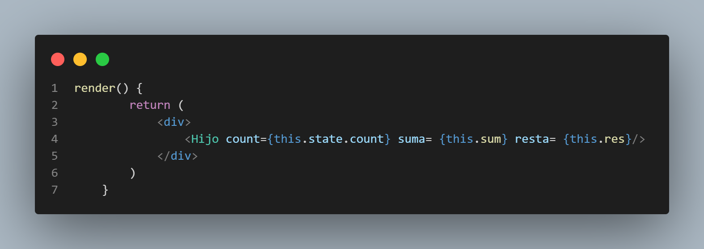
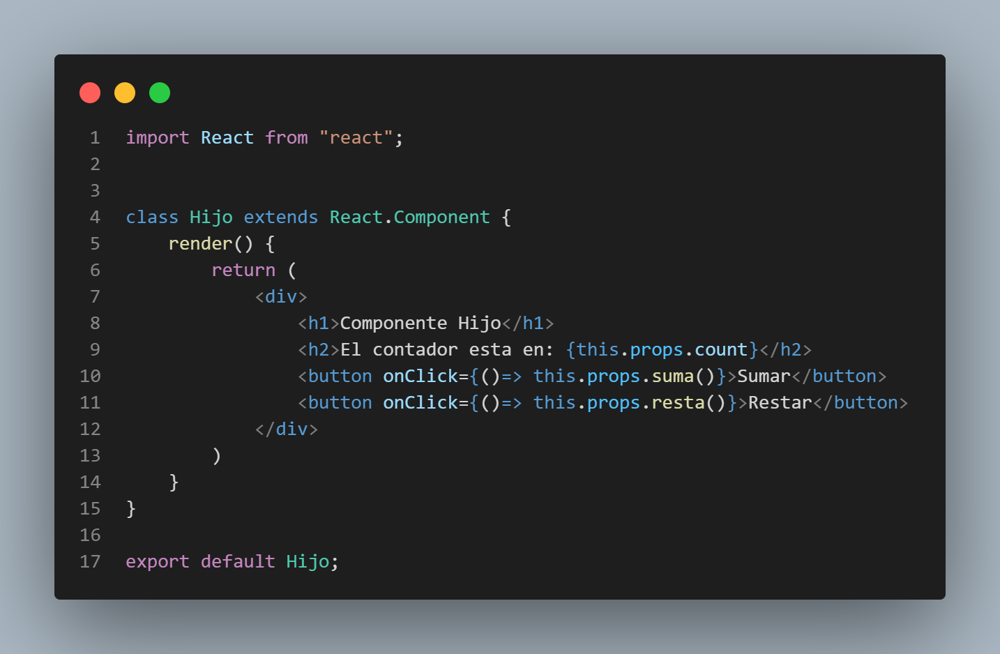

# Apuntes de clase
En esta clase vamos a ver, que es el estado y como implementarlo con un componente de clase.

El estado en algún punto se parece a las props, porque es información que maneja el componente, pero a diferencia de las props el estado es inherente al componente. El estado es diferente información que tiene el componente que puede variar. En cambio las props no pueden variar. Cuando le pasamos props a un componente le pasamos un valor fijo. En cambio el estado es información que el componente tiene y que yo la puedo cambiar a través de funciones.
Recordemos que al trabajar con clases tenemos objetos y tenemos métodos. A través de un método en particular nosostros vamos a poder modificar ese estado. ¿Pero ese estado que es? Ese estado puede ser el valor de una variable. En realidad es la propiedad de un objeto. Por ejmplo, puede ser un número de un contador. Esa es la idea, el estado es del componente. Definimos que el componente tenga ese estado, ese componente con ese valor y después a traves de determinados métodos que vamos a configurar en esa clase, desde afuera vamos a poder cambiar esos valores. "Desde afuera" puede ser desde otro componente, a travpes de un evento generalmente. 

Ejemplo: contador
Tendremos dos componentes: 
- Componente Padre: el más complejo, va a llevar toda la lógica, pero no lo va renderizar.
- Componente Hijo: se encarga de renderizar el contador en el DOM. Nos va mostrar los botones, va a hacer que esos botones funcionen y nos va motrar el valor que va tomando el contador a medida que apretamos esos botones

## Componente Padre: 

- Para un componente de clase, siempre tenemos que hacer el extends para que traiga la funcionalidad de la clase Padre `React.Component`-
- Lo primero que hacemos dentro del componente, es definir el estado. Hay diferentes formas de definir un estado, pero para este caso puntual lo haremos definiendo la propiedad de un objeto state. Esta propiedad se llamará `count` e iniciará con el valor 0. 
- Por Fuera de este objeto hacemos dos métodos (funciónes) que se van a encargar de modificar (sumando o restando 1) a la propiedad count. Estos métodos son básicamente como los setter de Java. Las funciones las hacemos tipo arrow functions y dentro de ella aplicamos el método `setState`. Anteponemos la palabra reservada `this` para indicarle que se aplica al componente en el que estamos situados. 
- Dentro de los paréntesis del setState utilizaremos una función callbacks (está función ya viene integrada con el setState), que lo que hace por defecto React cuando utilizamos esta función es: al parámetro que le pasamos al inicio representa el estado anterior. 
- Dentro del return de la función, vamos a pasar lo que queremos que ocurra. En nuestro caso, a la propiedad count "del último estado que hubo" le sumamos 1. 

- hacemos una función igual para la resta. 
- y por último el método `render()` que es necesario para que un componente de clase se renderice. Dentro de este método y dentro de un DIV vamos a pasar el Hijo con tres props:
    1. Primero el atributo count del objeto state.
    2. Segundo, la función sum
    3. Y por último, la función rest.

Para todos estos casos anteponemos la palabra reservada this para dar cuenta de que estamos hablando de esa instancia en particular. 

## Componente Hijo: 
El componente solo se renderizará a partir de su correspondiente método Render y dentro de él pasaremos las props correspondientes.
Con respecto a los eventos los manejamos a través de botones. La forma de lamar a eventos en React es muy parecida a la forma que veiamos en frontendII para llamar un evento desde el HTML. Se usa así para poder utiliazr eventos en el HTML que usamos a partir de JSX, entonces nos queda todo junto. Su sintáxis es simmilar a aquella que veiamos en frontendII pero no es la misma. Dentro del `onClick` podríamos pasar directamente el evento, pero vamos a pasarlo a través de una función callbacks para que realice la función solo cuando se clickee el botón. Es decir, para no correr el riesgo de que la función se ejecute antes. Dado que el concepto de callback nos dice que solo se va a ejecutar la función cuando termine de ejecutarse la anterior. En todos estos casos a las props se le antepone la palabra this.

