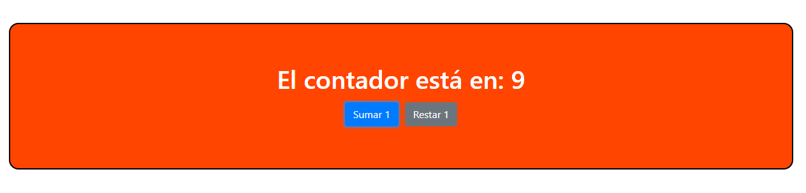

# Apuntes de clase

- Desestructuración de Arrays y Objetos en JS a partir de ECMAScript 6
- Creación de un contador con el Hook useState.
- Utilización de Bootstrap a partir de la importación de su CDN en el HTML
- Incorporación de estilos css modularizado

## Resultado final

### Pasos para correr el proyecto
Relizar primero `npm install`
Relizar segundo `npm start`