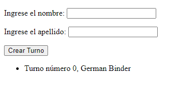

# Práctica integradora eventos

## Consigna

En este ejercicio pondremos en práctica lo visto en la clase sincrónica. Deberán crear un formulario que reciba turnos de un consultorio médico. Contará con los siguientes datos: 
- nombre
- apellido

Además asignaremos a cada ingreso un número único que será el turno de cada paciente. 

`TIP` (el índice del array puede ser útil para esto)

A medida que se vayan ingresando los turnos deberán verse reflejados en pantalla. 

En caso de haber terminado te invitamos a aplicar CSS de cualquiera de las formas vistas.

### Resultado Final

### Pasos para correr el proyecto
Relizar primero `npm install`
Relizar segundo `npm start`