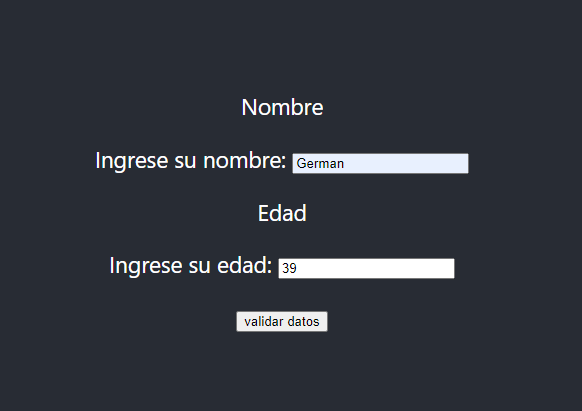
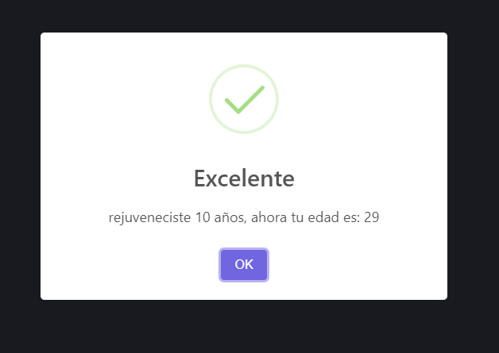

# Práctica integradora: manejo de eventos

En esta clase abordamos una gran cantidad de temas. Desde hoy, seremos capaces de hacer aplicaciones React más interesantes y con más herramientas, gracias al control de eventos y formularios. Ahora, es tiempo de practicar. ¿Estás listo?

## Consigna:

Creá un componente controlado llamado Rejuvenecedor, con 2 campos: nombre y edad. En el nombre, validá que es un string con al menos un caracter. La edad debe ser un número entero positivo. Al dar submit, hacé que nos quite 10 años de edad mostrándonos nuestro nombre y nuestra nueva y feliz edad con SweetAlert.

## Aclaración: 
La consigna se pudo hacer, pero sin usar el Hook useState(). 

## Resultado Final:

### Pasos para correr el proyecto
Relizar primero `npm install`
Relizar segundo `npm start`